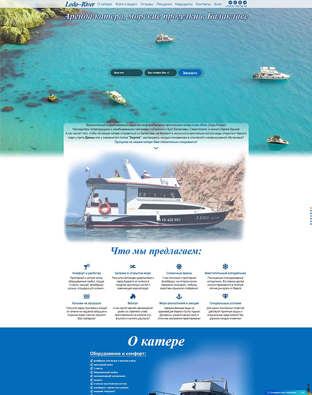

# Сайт для прогулочного катера Leda~River

## О проекте:

Многостраничный сайт для прогулочного катера Leda~River.

- Срок выполнения: 60 дней (сайт постоянно дополняется и дорабатывается)
- Количество страниц: 20
- Демо онлайн: [leda-river.ru](https://leda-river.ru)
- Код на Github: [github.com/Anatoluch/leda-river](https://github.com/Anatoluch/leda-river)

## Технологии:

Адаптивная кроссбраузерная верстка, HTML5, CSS3, препроцессор Less, JavaScript, jQuery, PHP.

## Особенности:

Адаптивная кроссбраузерная верстка под любые устройства, мобильная навигация (меню типа "гамбургер"), "прилипающее", при прокрутке страницы, сверху меню, как для ПК версии, так и для мобильной версии сайта (JS и jquery), фото и видео галереи, параллакс-эффекты, анимации, "карусель" с отзывами, контроль cookies (на JS), интеграция карт и кнопок "поделиться в соцсетях" от Яндекс, а такжке чата jivosite. Формы отправки данных (обратная связь, онлайн заявка на бронь (модальная), написания отзыва) со счётчиком количества введённых символов, ajax валидацией (jquery validate + контроль типа и языка вводимых данных в инпуты) и отправкой введённых данных, проверкой загружаемого файла (расширение и размер прикрепляемого файла для отзыва проверяется через html, JS, PHP и .htaccess), кастомной защитой от ботов на чистом JS (математическая капча и контрольный вопрос). А также, защита e-mail и номера телефона на всех страницах сайта от копирования спам-ботами через JS. Полная SEO оптимизация и продвижение сайта и многое другое...

---

_Если Вам нужен специалист по верстке сайтов - обращайтесь! Я с удовольствием помогу!_
